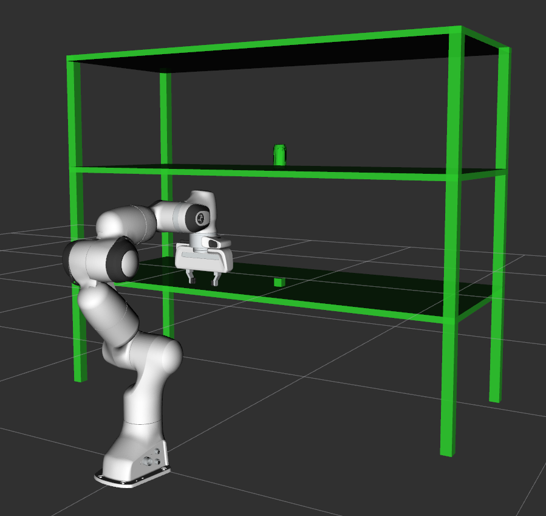
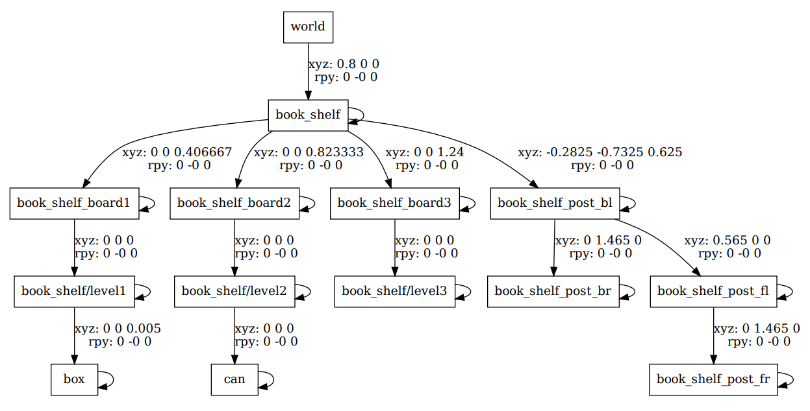

# URDF to PlanningScene

Create and parse collision objects from a URDF to a MoveIt CollisionObject message. 

**This package is under development by an intern! The API is extremly unstable and incomplete.**

Load collision objects from a URDF to a planning scene:
```shell
# Open Panda demo in another terminal
# roslaunch moveit_resources_panda_moveit_config demo.launch

roslaunch urdf_to_scene load_urdf_scene.launch
```
<p align="center">

</p>

Create diagram of URDF:
```shell
# Create urdf
rosrun xacro xacro scene.urdf.xacro > scene.urdf

# Create graph
urdf_to_graphiz scene.urdf
```
<p align="center">

</p>
