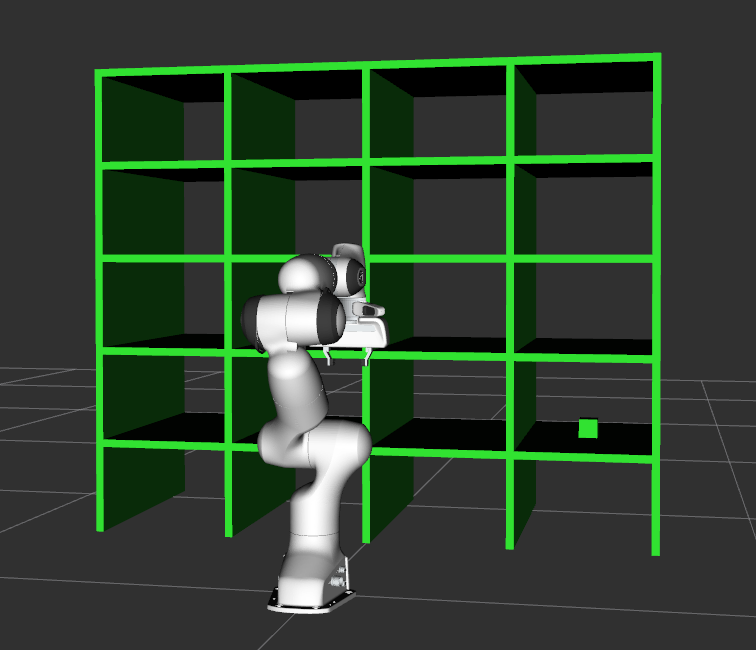
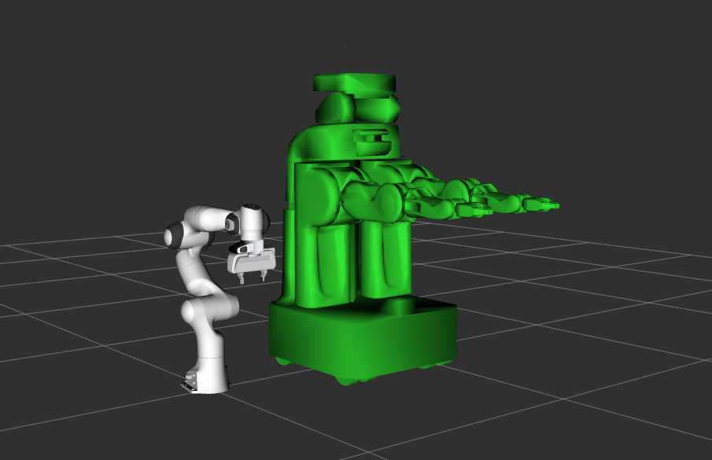

# URDF to PlanningScene
**This project is under development. The API is unstable and incomplete.**

The URDF to PlanningScene is a toolbox for creating and converting a URDF into a MoveIt *PlanningScene* message. It comes with a Xacro library which makes it easy to add collision objects into your world. A collection of complex primitive objects is also available such as shelves and crates. You can even convert your robot URDF into a collision object directly!

## Example
Planning scene xacro representation and RViz output.




``` xml
<robot name="planning_scene">

    <link name="world"/>

    <xacro:shelf
        name="bookshelf"
        frame_id="world"
        xyz="0.8 0 0"/>

    <xacro:collision_box 
        name="box"
        frame_id="bookshelf_board1/top"
        xyz="0 0 ${0.05/2}"
        dimensions="0.05 0.05 0.05"/>
    
</robot>
```

## Demo

Load a planning scene:

``` shell
# Run the panda demo in another terminal
# roslaunch moveit_resources_panda_moveit_config demo.launch

$ roslaunch urdf_to_scene load_scene.launch
```

Load the PR2 robot alongside the panda:

``` shell
# Run the panda demo in another terminal
# roslaunch moveit_resources_panda_moveit_config demo.launch

$ roslaunch urdf_to_scene load_robot.launch
```

<p align="center">
  
</p>
